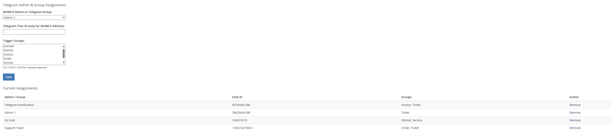
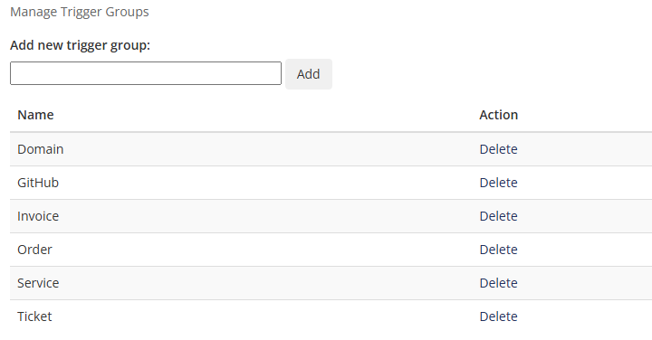
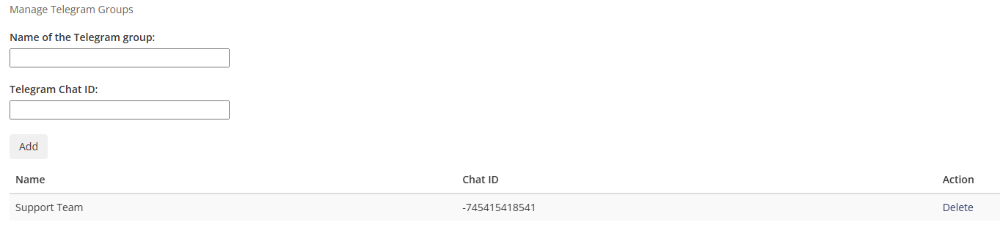
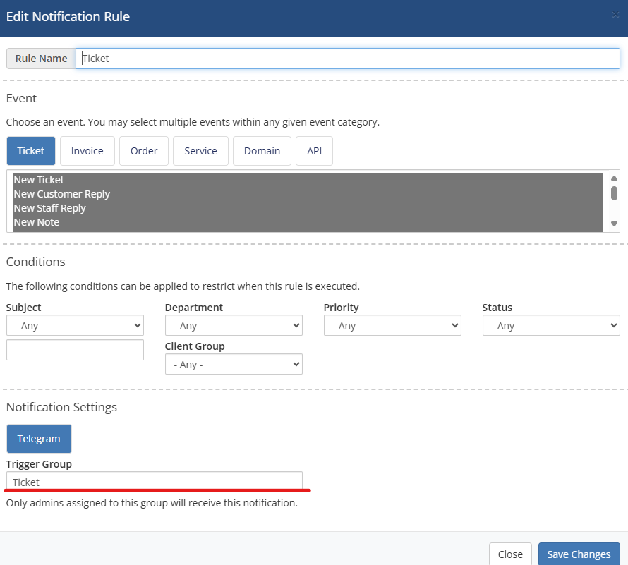
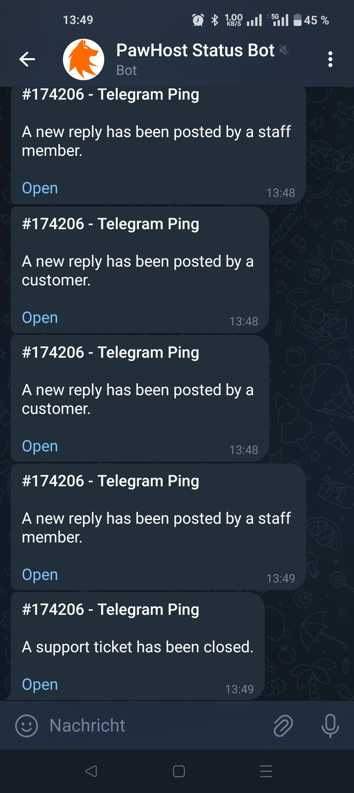

# WHMCS Telegram Notification Module

Send automated admin notifications from WHMCS to Telegram based on trigger groups. Supports multiple admins, chat groups, and configurable alert scopes.

## 📦 Features

- 🔔 Send WHMCS admin notifications directly to Telegram
- 👥 Assign multiple Telegram chat IDs or groups per admin
- 🧠 Filter notifications using **Trigger Groups**
- ✅ Easy bot setup with test connection support
- 🛠 Built for WHMCS's native notification system

---

## 📸 Screenshots

### Admin & Group Assignment
> _Example of linking WHMCS Admins and Telegram groups_

### Trigger Group Management
> _Add, remove, and manage custom trigger groups_

### Telegram Group Management
> _Add, remove, and manage custom Telegram groups_

### Notification Trigger
> _How to set up the trigger to a group_

### Notification in Telegram
> _How notifications appear in your Telegram app_

---

## 🚀 Installation

1. **Upload the module**
   - Place the files under:  
     `modules/notifications/telegram/`

2. **Create the required database tables**
   - You can use the activation SQL or use the legacy activation module to auto-create:
     - `mod_telegram_admins`
     - `mod_telegram_groups`
     - `mod_telegram_chatgroups`

3. **Configure the module in WHMCS**
   - Go to: `Setup` > `Notifications`
   - Add new notification rule with "Telegram" as the provider
   - Enter your **Telegram Bot Token**

4. **Set up Trigger Groups**
   - Assign WHMCS admins or Telegram chat groups to specific trigger groups
   - Only these will receive the corresponding notifications
  
5. **Set up Notification**
   - Go to Notifications and create a new notification rule
   - Set up the event and the conditions. Insert the trigger group under the Telegram field

---

## 🤖 How to Get a Telegram Bot Token

1. Open Telegram and start a chat with [@BotFather](https://t.me/BotFather)
2. Run `/newbot` and follow the instructions
3. Copy the **Bot Token** provided

---

## 🧪 Testing

To verify your Telegram bot configuration:
- Use the **Save Changes** button in the Notification settings
- A test message will be sent to the first available chat ID in your configuration

---

## 🛠 Customization

- To define custom trigger groups, insert them into `Manage Trigger Groups` table
- Extend filtering logic by modifying the `Notification` settings

---

## 🧾 Database Tables

| Table | Purpose |
|-------|---------|
| `mod_telegram_admins` | Stores admin/chat ID and group mappings |
| `mod_telegram_groups` | Defines logical trigger categories |
| `mod_telegram_chatgroups` | Named Telegram chat group entries |

---

## ❓ FAQ

### Can I send messages to group chats?

Yes. Use the group’s chat ID (e.g. `-1001234567890`) when assigning.

### Are Markdown messages supported?

Yes. Telegram messages use Markdown parse mode by default.

### Is the bot GDPR/DSGVO compliant?

Yes. No customer data is sent. Only the title and ticket link.

---

## 📄 License

MIT © PawHost.de

---

## 🙌 Contributions

Feel free to open issues or PRs to improve this module!

